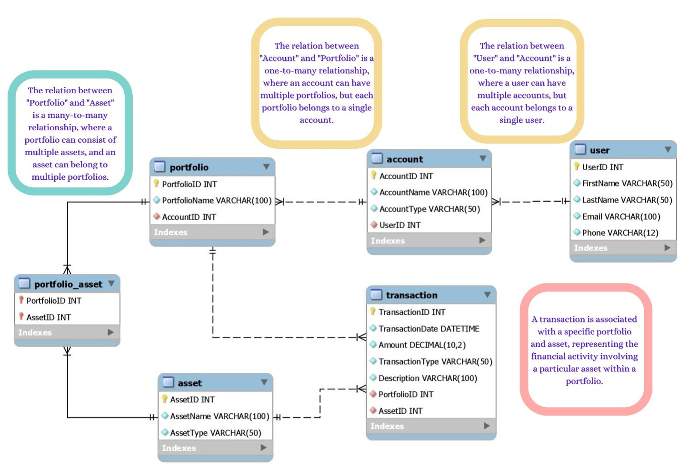

# Personal Finance and Investment Management Application

In today's fast-paced world, managing personal finances and investments has become increasingly important. This project aims to provide a comprehensive solution for managing personal finances, investments, and portfolios. Whether you're striving for financial goals, monitoring investments, or planning for the future, the Personal Finance and Investment Management Application is a web-based platform designed to simplify and enhance your financial journey.

## Features

### User Management
Users can register and access their financial information.

### Account Management
The application supports the creation and management of multiple financial accounts, including checking, savings, and investment accounts.

### Portfolio Tracking
Keep track of your investment portfolios effortlessly. The application provides tools to monitor portfolio performance and view asset allocations.

### Transaction Recording
Record financial transactions such as deposits, withdrawals, and investments. Each transaction includes details like date, amount, portfolio, and asset.

### Asset Management
Manage various types of assets, including stocks, bonds, real estate, and more. Store essential information for each asset, such as name and type.

### Portfolio Insights and Transaction Tracking
Gain valuable insights into your financial portfolio and track transactions effectively. Explore detailed overviews of users' portfolios and their transaction history, presented as separate tables for enhanced clarity. Additionally, the application computes and displays the final balance, offering a comprehensive view of the financial status.

### Entity Relationship Diagram (ERD):

## Technology Stack

- Frontend: HTML, CSS, JavaScript
- Backend: Spring Boot
- Database: MySQL
